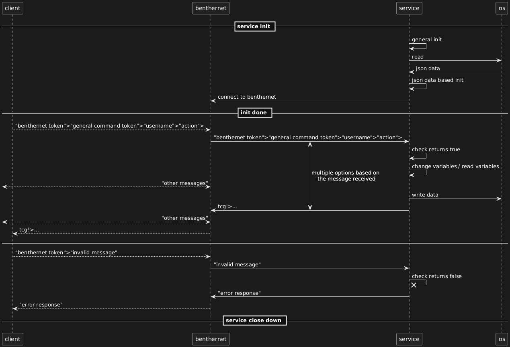

# Tcg service

## Base game explenation

### Trading Card Game

A game that is based around collecting and fighting other cards.

Players will be able to collect mana, this mana can be used to get cards and play them. Some cards will make the player receive more mana or upgrade the amount of mana they can have at maximum. This while they can be attacked by other players if they wish to engage in battle.

### Cards

There are three main type of cards, tools, spells and monsters. Tools can be used to upgrade certain values like maximum mana or the amount of monsters someone can have in play, while spells are instant effects that can do various things. Then there are monsters wich need mana to be summoned and can be used for defence or attack.

### Life points

Players need to be carefull though, as they can be attacked by other players at random. If a player loses all of there life points, they will lose some of the cards they collected, wich can lead to defestating chains if they lose the card witch upgraded the amount of mana they got every action.

## Service calls over benthernet

### Basic message construction

All messages used by the service and the clients are constructed the same way, and listed below.

```
- benternet token>
- general command token>
- username token>
- action token >

examples:
    "tcg?>action>quinten>get max mana>"
    "tcg!>signup>quinten>succesfully signed up>"
    "tcg?>help>"
```

Each type of token will be discussed seperatly.

### Benthernet token

To make sure no mixing between receiving and sending messages happens, the service will always expect to receive a specific benthernet token.

```
When sending a request: "tcg?>"
When returning a response: "tcg!>"
```

### General command token

The first token after the benthernet token is always the general command token. It is used to decide what the service needs to do, or what type of response the service has send.

Listed below is a list of all the possible general command token's ( this is the same list when a user uses the "tcg?>help>" general command )

```
list  of all general command tokens:
    - signup>   used to register a new account
    - action>   used to perform a player specific action
    - help>     prints out a helpfull quick start in game
```

### Username token

Very straight forward, this token is used to determine which user used the command. It can be used to login to a certain account or perform an action on the logged in account.

### Extra token

Most of the commands however are user specific. After the username is inputted the service will expect the extra token to be this command. Listed below are all possible commands to be used.

```
- action>(username)>(extra)>

list of all possible extra tokens:
    - get mana count        get a players mana count
    - get max mana          get the maximum amount of mana a player can have
    - gather mana>(count)   gather more mana if possible
    - search card           use mana to search for a new card

examples:
    "tcg?>action>quinten>get max mana>"
    "tcg?>action>quinten>search card>"
```

If an invalid username is used, for example the user is called "quinten" but tries using "quinte" the service will return an error message that a "wrong username" was used. 

## Flow chart


## Examples

### Login and signup

```
tcg?>signup>quinten>

    tcg!>signup>quinten>succesfull signup>

tcg?>action>quinte>get mana count>

    tcg!>action>quinte>not a valid username>

tcg?>action>quinten>get mana count>

    tcg!>action>quinten>you have 5 mana left>

...
```

## Have fun!
